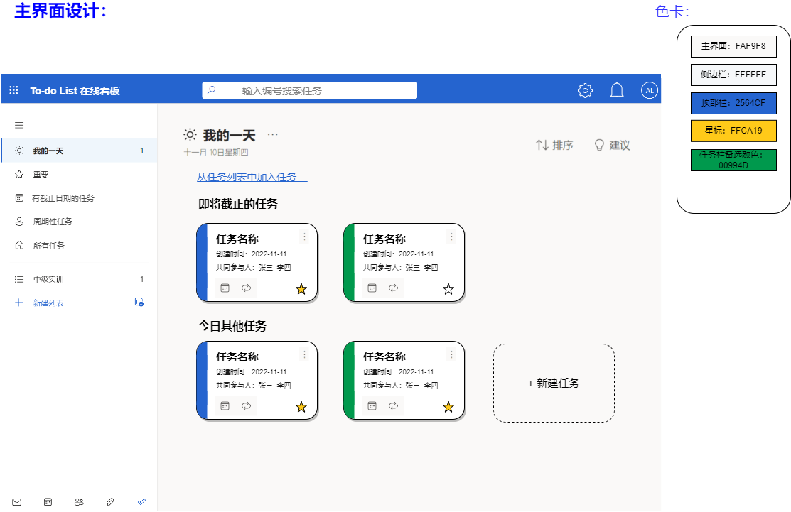

# <center>To-do List 在线看板网站项目说明文档</center>
<center>
项目成员：杨翼飞 李安吉 吕敬 刘浩然 王凡<br>
指导教师: 黄袁 &emsp; 助教：陈中麒<br>
2022年11月——2023年1月
</center>

## 人员分工
<center>

|组员|分工|
|:--:|:--:|
|杨翼飞|数据库，后端开发，前后端接口测试，<br>项目文档数据库与后端实现和测试部分|
|李安吉|界面设计，前端开发，前后端接口测试，<br>项目文档前端实现部分、接口文档|
|吕敬|前端组件开发，项目文档需求分析与设计部分|
|刘浩然|前端组件开发，项目文档需求分析部分|
|王凡||
|</center>||

---

## 1 项目介绍
To-do List在线看板是一个结合待办任务checklist和小组项目可视化同步管理功能的服务网站项目，是一个简单而功能强大的任务管理网站，可以帮助用户记录和管理代办任务，该项目具有以下功能：
* 用户管理：支持用户注册和登录。
* 任务管理：支持用户创建、编辑和删除任务，为任务添加子任务等。
* 任务分类：支持用户将任务分类为不同的类别，如是否重要、是否具有周期性、是否有截至日期以及添加新的任务列表等。
* 消息提醒：支持在指定时间提醒用户完成任务，加入群组信息反馈等。
* 任务状态：支持用户标记任务为已完成或未完成。
* 共享任务：支持用户将任务以群组方式共享给其他用户，或者添加共同参与人。

---
## 2 项目需求分析
### 2.1 任务概述
#### **2.1.1 背景**
* 随着社会发展和生活节奏的加快，人们需要一种工具更高效地管理自己的时间和任务。而传统的日程安排和任务管理方式已经不能满足人们的需求。我们以微软的TodoList应用项目为模板，设计的这款To-do List在线看板网站就是为了解决这个问题。
* 它提供了一种简单而强大的任务管理工具，帮助用户记录和管理他们需要完成的任务。
* 我们的To-do List在线看板具有用户管理,任务管理,任务分类,消息提醒,任务状态,共享任务等功能，使用户能够更高效地管理自己的任务。
* 我们的目标是通过这个应用程序来提高用户的工作效率，帮助用户更好地掌控自己的时间和任务。

#### **2.1.2 定义**
在本项目中，设定一些基本概念如下：
1. 用户：在该网站中已经注册账号的使用者。对于对于访问到本网页但未进行注册或登录的浏览者，我们不对其展示主要功能界面，并引导浏览者注册账户。
2. 任务：用户创建的待办事项，其中必包含内容为任务名称、创建时间、是否重要，可选择包含内容有任务描述、子步骤、截止时间、周期性、附件、共同参与人、评论等。
3. 任务列表：包含一个到多个任务不等的集合，可以认为是管理任务的文件夹，一部分为网站固定设置，根据任务的不同属性进行分类，另一部分由用户自行创建并设置
4. 任务群组：由共同参与一项任务的用户组成的集合。在一个任务群组里，组员同步任务进度。

#### **2.1.3 用户特点分析**
在分析To-do List在线看板的用户特点时，可以考虑以下几个方面:

* 工作/学习需求: To-do List在线看板 的主要用户是那些需要管理自己的时间和任务的人，如工作人员、学生等。

* 效率需求: Todo List 的用户希望能够更高效地管理自己的任务，以提高工作效率。

* 群组协作需求: To-do List 在线看板的用户需要在群组中进行任务管理和协作，如添加共同参与人，实时更新团队的修改内容，群组消息提示等

* 可视化需求: To-do List 在线看板的用户希望能够通过看板的形式清晰地了解项目进度和任务状态。

* 实时更新需求: To-do List 在线看板的用户希望能够实时了解项目进度和任务状态。

根据这些用户特点，我们可以为 To-do List在线看板的设计和开发提供更好的指导。

### 2.2 实现目标

#### **2.2.1 用户信息**
网站中的用户可以通过手机号/邮箱创建账号，并填写用户昵称、密码等必要信息完成账号注册。在之后的使用过程中，用户可以选择修改个人头像、绑定的手机号/邮箱和密码。

若用户长时间不使用该网站，或用户自行选择注销账号，网站支持删除账号信息。（对于其创建的任务，展示信息时会显示“用户已注销”。（这个属于拓展功能，来不及做就删掉））

#### **2.2.2 待办任务创建**
用户可以点击“新增任务”选项，填写任务名称，是否重要两个必选项，以及任务描述、截止时间、归属任务列表等上文中提到的任务包含的可选内容，确认后完成待办任务的创建。

#### **2.2.3 待办任务管理与任务列表**
在任务执行过程中，用户可以修改任务的重要性、截止日期和周期性，以及增加、修改或者删除任务的子步骤来调整任务的具体内容。

同时，用户也可以自行创界任务列表，通过向列表中添加任务，或移动任务所归属的任务列表，来实现对任务的管理。

#### **2.2.4 任务群组与共同参与人**
当用户创建一个任务以后，我们默认该任务具有群组属性，该用户成为此任务群组的群主，可以添加其他用户作为共同参与人。一个任务群组中的组员可以同步更新任务详细内容和任务进度。

用户可以通过分享链接的方式来邀请其他用户加入任务群组，也可以通过搜索任务编号的方式申请加入一个任务群组，当群主同意该用户进入群组后，该用户成为任务的共同参与人。

#### **2.2.5 消息提示栏**
消息提示栏部分用于展示和用户参与的任务相关的动态信息。例如共同参与人更新任务信息、用户申请加入任务群组，以及申请加入群组成功/失败等信息。
#### **2.2.X 后面有扩展功能再写吧**
<br>

### 2.3 需求规定
#### 对功能的规定：
功能规定:
* 用户管理: 允许用户注册和登录,管理员添加，删除用户
* 任务管理: 允许用户创建、编辑和删除任务。
* 任务分类: 允许用户将任务按重要性，周期性等方式分类，也可以自定义任务列表分类。
* 消息提醒: 提醒用户完成任务，群组消息，任务更新消息等，可以设置消息的已读和未读状态。
* 任务状态: 允许用户标记任务为已完成或未完成。
* 共享任务: 允许用户将任务通过群组共享给其他用户。
#### 数据管理能力要求
* 数据存储: 项目应该使用可靠的数据存储技术来存储用户数据和任务数据。
* 数据安全: 项目应该采取措施来保护用户数据和任务数据的安全。
#### 故障管理能力要求
* 故障监控: 应用程序应该实现故障监控功能，及时发现和解决故障。
* 故障恢复: 应用程序应该实现故障恢复功能，以便在发生故障时恢复数据。
* 故障报告: 应用程序应该提供故障报告功能，以便用户可以及时报告故障。
#### 其他专门要求

---
## 3 项目功能设计
### 3.1 系统结构描述
在对Todolist网页的需求分析的基础上，对系统整体进行了设计，此系统总体结构图如下。


从Todolist体系结构总图中可以看出，系统体系结构由两个大的分类模块组成。为了进一步说明系统的体系结构框架，对系统的两大主要分类模块进行了详细的设计，各自的功能结构图如下所示：

#### 3 1.2 任务模块结构图


#### 3 1.3 用户模块结构图


### 3.2 子系统功能描述
#### 3.2.1用户信息子系统
用户信息子系统主要作用是用于用户管理自己的账号及个人信息，这要求该部分具有很高的安全性，在程序设计时要保证数据安全。并且为了给用户更好的使用体验，数据的更新速度要足够快。
##### 3.2.1.1创建用户账号
输入账号、密码、用户名等信息，点击注册
完成创建用户账号
##### 3.2.1.2根据账号获取用户信息
账号与用户信息相对应
通过获取账号即可获取它所对应的用户信息
##### 3.2.1.3修改用户信息
根据账号id,修改请求数据中对应的字段
对用户信息进行修改
保存完成修改的用户信息
##### 3.2.1.4修改用户头像/获取头像信息
上传头像图片到后端
根据头像地址获取图片数据
##### 3.2.1.5注销账户
删除对应id的账户记录
#### 3.2.2任务列表子系统
任务列表子系统主要用于用户创建，修改改和删除任务列表。创建完任务列表后，用户就可以在该列表内新建任务了。
##### 3.2.2.1为用户新建任务列表
输入任务列表名称
输入的名称不能与已存在的任务列表名称相同
根据所输入的名称创建出新的任务列表
##### 3.2.2.2修改任务列表名称
选择要修改的任务列表
输入新的任务列表名称
新的任务列表名称不能不变或与其他任务列表名称相同
##### 3.2.2.3删除任务列表
删除对应名称的任务列表及其内部任务项
#### 3.2.3任务项子系统
任务项子系统主要用于用户创建，修改和删除任务，并且可以根据任务id来获取相应的任务信息。该子系统同任务列表子系统共同完成该项目的核心功能。
##### 3.2.3.1新建任务
输入任务名称、参与人、截止时间等信息
任务创建完成，自动分配任务id
##### 3.2.3.2根据任务id获取任务信息
输入任务id
输出对应id任务的详细信息
##### 3.2.3.3修改任务信息
选择要修改的任务项
选择要修改的一条或多条任务项信息
对所选的任务项信息进行修改
至少要有一条任务项信息被改变了
##### 3.2.3.4删除任务
删除对应任务id的任务项及其记录
#### 3.2.4任务群组子系统
用户创建一个任务以后，默认该任务具有群组属性，该用户成为此任务群组的群主，他可以添加其他用户作为共同参与人。任务群组子系统则用于查找任务群组的创建人，以及添加和删除共同参与人。
##### 3.2.4.1查询任务群组的创建人
输入任务群组id
输出任务群组创建人账号id
##### 3.2.4.2添加共同参与人
选择要添加共同参与人的任务群组
输入共同参与人的账号id
对目标用户发出添加邀请
##### 3.2.4.3删除共同参与人
选择要删除共同参与人的任务群组
在该群组选择要删除的共同参与人
将任务群组的共同参与人信息中删除对应共同参与人的信息
#### 3.2.5消息提示子系统
消息提示子系统用于展示和用户参与的任务相关的动态信息。例如共同参与人更新任务信息、用户申请加入任务群组，以及申请加入群组成功/失败等信息。
##### 3.2.5.1查询用户对应的消息
用户对应的消息与账号id相对应
通过用户的账号id即可获取用户对应的消息
##### 3.2.5.2修改消息的已读/未读状态
选择某一未读消息
点击该未读消息
该未读消息变为已读消息
##### 3.2.5.3为目标用户生成消息
选择要生成消息的目标用户
对该目标用户发送消息

### 3.3 数据设计
* 用户数据: 包括用户名、密码、邮箱、权限等信息。

* 任务数据: 包括任务名称、描述、创建时间、截止时间、重要性、周期性、完成状态、分类等信息。

* 分类数据: 包括分类名称、描述、任务数量等信息。

* 消息数据: 包括消息类型，消息内容，发送时间，已读状态等信息

* 共享数据: 包括任务id,共享人员,是否共享等信息

* 看板数据: 包括项目进度，任务状态，图表等信息

这些数据应该存储在可靠的数据库中,并通过合适的数据模型来组织和维护。
### 3.4 用户接口设计
* 用户登录/注册界面: 用户可以在此界面输入用户名和密码进行登录，或输入用户名，密码,邮箱进行注册。

* 任务列表界面: 用户可以在此界面查看所有任务的详细信息，并对任务进行排序和过滤。

* 任务详细信息界面: 用户可以在此界面查看任务的详细信息，并对任务进行编辑和删除，添加子步骤和共同参与人。

* 任务创建/编辑界面: 用户可以在此界面输入任务的详细信息，如任务名称、描述、截止日期、优先级等。


* 用户管理界面: 用户可以在此界面查看所有用户,并对用户进行管理

* 可视化看板界面: 用户可以在此界面查看项目进度和任务状态

* 消息提醒界面，用户可以在此界面查看所有消息提醒
### 3.5 交互界面设计
初步设定主界面设计如下：


---
## 4 项目功能实现——前端部分

**P.S.** 如需运行本项目感受实现效果，可以参考 [起步说明](intro.md)

本项目前端部分整体采用 [Vue 3.2.8](https://cn.vuejs.org/) 框架结构，并引入 [element-plus](https://element-plus.gitee.io/zh-CN/component/button.html) 组件库和 [element-icon](https://element-plus.gitee.io/zh-CN/component/icon.html) 图标组辅助界面设计，使用 [Axios http网络请求库](https://www.axios-http.cn/) 进行前后端数据交互。
渲染层开发语言为 html+css, 逻辑层开发语言为 javascript、typescript。

### 4.1 整体项目文件结构
项目的文件结构设计如下：

- public: 通用资源
- src: 项目的主要结构
	- assets: 静态资源，例如通用的css样式、界面会用到的图片等
    	- css: 通用样式
		- icons：使用的图标
	- components: 通用组件
	- http: 连接后端的api
        - api：实现由接口文档规定的接口
        - util: 由接口派生的适用于页面展示的方法
	- pages: 页面文件，采用一个页面配置一个文件夹的结构设计。
	- router: 网页路由，具体的路由设置在`index.js`中实现
	- store: 使用 `vuex` 实现的全局变量存储
	- `App.vue`: 框架的启动页面
	- `main.js`: 框架入口
- `vite.config.js`:vite打包的配置文件。
- UIdesign 界面设计图 

### 4.2 页面设计
#### **4.2.1 主页面设计**

**设计详细说明：**

* 页面布局：页面将采用简洁明了的卡片式布局，分为顶部导航栏、中间任务列表和侧边栏三部分。
* 中间任务列表：任务列表将展示所有已添加的任务，每个任务卡片包括任务名称、创建时间、任务状态、重要性等属性栏。
* 顶部导航栏：包含网站图标，搜索栏，消息提示图标，用户头像。
侧边栏：按重要性、周期性等属性为任务分类的目录，包含我的一天、重要、有截止日期的任务、周期性任务和所有任务，以及一个新建列表的按钮

**设计规范：**

* 颜色： 
	* 主界面：FAF9F8，顶部栏： 2564CF，侧边栏：FFFFFF，星标：FFCA19，任务栏备选颜色：00994D。
* 图标：采用 el-element 图标库.

#### **4.2.2 任务详情页面设计**

设计详细说明：

* 页面布局：页面将采用简洁明了的卡片式布局，分为顶部导航栏、中间任务详情列表两部分。
* 顶部导航栏：包含网站图标，搜索栏，消息提示图标，用户头像，返回主界面按钮。
* 中间任务详情：包括任务概况，子步骤，动态，共同参与人，附件五个部分

设计规范：

* 颜色：
	* 主界面：#F5F6F7，顶部栏： #2564CF，侧边栏：#FFFFFF，星标：#FFCA19，未完成子步骤：#FFCC99，已完成子步骤：#97D077。
* 图标：采用 el-element 图标库.

### 4.3 组件结构与页面实现

#### **4.3.1 页面设置**
本项目共设计页面如下：

<center>

|路由|所在文件夹|页面功能|
|:-:|:-:|:-:|
|`/hello`|[/hello](/src/pages/hello/)|项目首页|
|`/login`|[/login](/src/pages/login/)|登录界面|
|`/registor`|[/registor](/src/pages/registor/)|注册账户|
|`/home`|[/home](/src/pages/home)|主界面|
|`/period`、`/ddl`、`/group`<br>`/important`、`/allTask`|[/jump](/src/pages/jump/)|按分类展示任务|
|`/folder/:fold/:name`|[/jump](/src/pages/jump/)|展示用户自定义列表的任务|
|`/taskDetail/:id`|[/task-detail](/src/pages/task-detail/)|任务详情界面|
|`/invite/:task/:user`|[/invite](/src/pages/invite/)|邀请加入任务群组|

</center>

#### **4.3.2 页面组件分解**
由于部分页面较为复杂，我们将其用组件结构分解实现。

主界面分解如下：


任务详情分解如下：


### 4.4 数据交互请求与api实现
#### **4.3.1 http请求接口设置**
这一部分主要规定请求的接口名称、请求参数和响应参数，详情可见 [接口文档](https://github.com/LeeAnnJ/Todo-list/blob/front-main/backend-database-interface.md)

#### **4.3.2** 接口实现

使用`axios`发送请求。在 `/src/http/axios.js` 完成基础路由和拦截器配置后，按项目文档声明每个接口的请求方法，并配置对应的数据，即可实现基本的请求接口，由此可继续开发适配于页面响应数据的方法。

具体可见`/src/http`文件夹。

---
## 5 项目功能实现——数据库部分

### 5.1 数据字典

数据字典详见数据字典文档

### 5.2 数据库设计

在完成数据字典定义后，我们进行了数据库设计。数据库的物理设计见下图：


从图像中我们可以看到，项目数据库由七个数据表组成，数据库和数据表的设计基本满足第二范式的要求。

---

## 6 项目功能实现——后端部分

### 6.1 后端项目框架

后端项目的基本框架如下图所示：


除去最左端的前端和最右端的数据库，后端整体业务代码由3层组成。

最靠近前端的一层为路由层。其使用Express框架自带的路由转发中间件实现，负责处理前端的发来的数据和向前端发送后端处理后的数据回应，具体实现方式将在6.2节详细说明。

中间一层为业务代码层，终于成为整个后端项目的核心。由3个部分组成。 我将这一层的各个对象大致分为3种：工具类、控制类和实体类。

+ 控制类（Controller）负责接收路由层转发的后端接收到的各类请求和对应的参数，根据不同的请求，控制层会进行不同的操作业务操作，控制不同的实体内容，在必要时调用对应的工具类中的工具函数，协助控制类的处理。控制类还有一大任务就是将其各类中返回的回调数据发送给路由层，作为对应的请求的回应。

+ 工具类（utils）就是整个业务代码之中所间接用到的一些工具的集合。这部分按代码不涉及具体的业务或数据库，主要就是一些工具函数。

+ 实体类（Entity）就是对应的各种数据实体。在我的函数设计中，我只给实体类操纵数据库的权限，以此来避免业务和数据之间的相互干扰。 实体类的实现过程中与数据库的表项基本上做到了一一对应的关系。其他所有业务代码如果需要操作数据，都必须通过操作实体类进行实际实体的编辑来进行数据库的调用。

最后点一层是通过 Repository 实现的数据库代理类，为了降低实现的复杂度和避免业务和数据库之间的相互干扰，我使用了Repository DDD设计模式。这一点我将在6.3节详细介绍。

### 6.2 技术选型

+ 项目语言： `TypeScript`
+ 项目框架：Node.js + Express 框架
+ 数据库：[MariaDB](https://mariadb.org/)，为了便于前端同学调试设置为和 MySQL 相同的3306端口

### 6.3 Router 接口路由转发表实现

Router是Express框架的一个 [路由中间件](https://expressjs.com/en/guide/routing.html) 功能，表示应用程序端点 (URI) 的定义以及端点响应客户机请求的方式。我们使用 app 与 HTTP 方法相对应的 Express 对象方法来定义路由，如 `app.get()` 用于处理 GET 请求，而 `app.post` 则用于处理 POST 请求。这些路由方法都指定了回调函数（或者：“处理程序函数”），当程序接收到指定的路由（端点）的时候（也就是说 HTTP 方法请求时被调用），来调用回调函数，换句话说就是应用程序监听与指定路由和方法匹配的请求，当检测到匹配时，他会调用对应的回调函数。

基本示意图如下：


基本原理示意图如下：


在后端的编写过程中，我对于不同的接口类型定义了不同的 router URL，在满足 Restful API 的同时也提高了代码的可读性。

以上是我们的接口定义文件，可以看到我根据不同的类型定义了不同文件，使用下述代码设置不同的 URL 前缀。

```typescript
// import routers
const indexRouter = require('./routes/index');
const accountRouter = require('./routes/account');
const taskRouter = require('./routes/task');
const messageRouter = require('./routes/message');
const groupRouter = require('./routes/group');
const folderRouter = require('./routes/folder');

// bind routers
app.use('/account', accountRouter);
app.use('/task', taskRouter);
app.use('/message', messageRouter);
app.use('/group', groupRouter);
app.use('/folder', folderRouter);
app.use('/', indexRouter);
```

### 6.4 Repository 数据库代理实现

#### 6.4.1 Repository 设计模式介绍

> "*A Repository mediates between the domain and data mapping layers, acting like an in-memory domain object collection.*
>
>  *Client objects construct query specifications declaratively and submit them to Repository for satisfaction.*
>
>  *Objects can be added to and removed from the Repository, as they can from a simple collection of objects,*
>
>  *and the mapping code encapsulated by the Repository will carry out the appropriate operations behind the scenes.* 
>
> *Conceptually, a Repository encapsulates the set of objects persisted in a data store and the operations performed over them,* 
>
> *providing a more object-oriented view of the persistence layer. Repository also supports the objective of achieving a clean separation and one-way* 
>
> *dependency between the domain and data mapping layers.*"

按照最初提出者的介绍，Repository 是衔接数据映射层和域之间的一个纽带，作用相当于一个在内存中的域对象集合。客户端对象把查询的一些实体进行组合，并把它们提交给Repository。对象能够从   Repository 中移除或者添加，就好比这些对象在一个Collection对象上就行数据操作，同时映射层的代码会对应的从数据库中取出相应的数据。


#### 6.4.2 Repository 实现

该模式最理想的实现方式是通过2个 Domain 进行网络通信从而进行数据库的操作。但是由于后端项目仅有1万行左右，规模相对比较小。为了降低代码框架的复杂度，我根据非必要勿增实体的原则仅设置了一个数据库代理类负责进行业务代码和数据库之间的联系。

在代理类的设计中，我遵循以下几个原则：

+ **数据业务隔离**：数据库代理不会插手任何业务相关的代码进行业务操作。
+ **数据完整性与原子性**：对于需要多个SQL语句进行的操作，统一使用事务来进行对应的数据库处理，保证操作的原子性。
+ **数据安全**：原则上数据库内容和数据库错误不对外暴露，仅对外返回指定函数的结果，进行一定的防诸如操作。
+ **可靠操作**：对于语言特性带来的异步处理语句统一进行同步化操作。

前面部分已经提到，在业务代码中，只有实体内可以调用数据库代理类。后来进行数据库操作，这是在该模式的基础上，进一步避免常规业务代码对于整个数据库安全的影响。 

---
## 7 项目测试

项目测试在单独的测试文档中。

## 总结

本次实训是一次较为完整的web项目实践，在锻炼我们的编程能力的同时，也培养了我们优化项目结构的意识。另外，前端使用的 `Vue` 框架和后端使用的 `Express` 框架都是目前较为流行的web应用开发框架，选择这两个框架的初衷是想尝试更贴近目前行业内的项目开发流程，从而达到实训“动手实践、自主学习”的教学目的。虽然项目的部分细节不是最完善的状态，但是希望我们的努力可以为本次实训交上一份合格的答卷。
